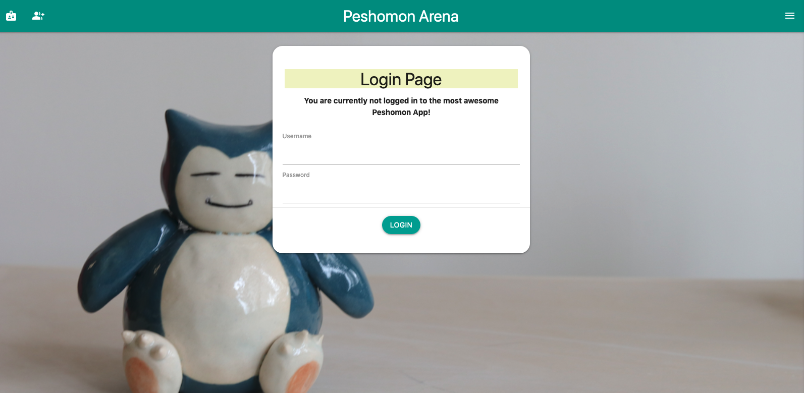
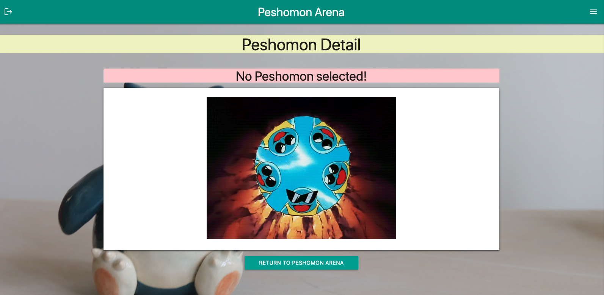

# PeshoMon
Demo project employing Angular 13 and the following auxiliary components :
→ Client Side : Angular 13
→ Authentication : Login, Logout, Register + Authentication Guard throughout whole App via CanActivate
→ Remote service : angular-in-memory-web-api + localStorage for data-persistence after page refresh
→ State management : RxJS
→ Animations effects : @angular/animations
→ Full Error handling + Data validation
→ Unit-tests:
→ Bonus: 1. materialize-css for full responsiveness + smartphone screen compatibility 2. Google Material Icons for graphical elements 3. Multiple backgrounds 4. Search box for individual peshomons 5. Homemade peshomon favicon !!!

--

### Main Page:

--

### Login Page:

--

### Register Page:

--

### Not Found Page:

--

### Data Validation:

--

### Peshomon Details Page:

--

### Peshomon Edit Page:

--

### Peshomon Add Page:

--

### Peshomon Search Page:

--

### Peshomon Not Found Page:

---

This project was generated with [Angular CLI](https://github.com/angular/angular-cli) version 13.2.5.

## Development server

Run `ng serve` for a dev server. Navigate to `http://localhost:4200/`. The app will automatically reload if you change any of the source files.

## Code scaffolding

Run `ng generate component component-name` to generate a new component. You can also use `ng generate directive|pipe|service|class|guard|interface|enum|module`.

## Build

Run `ng build` to build the project. The build artifacts will be stored in the `dist/` directory.

## Running unit tests

Run `ng test` to execute the unit tests via [Karma](https://karma-runner.github.io).

## Running end-to-end tests

Run `ng e2e` to execute the end-to-end tests via a platform of your choice. To use this command, you need to first add a package that implements end-to-end testing capabilities.

## Further help

To get more help on the Angular CLI use `ng help` or go check out the [Angular CLI Overview and Command Reference](https://angular.io/cli) page.
